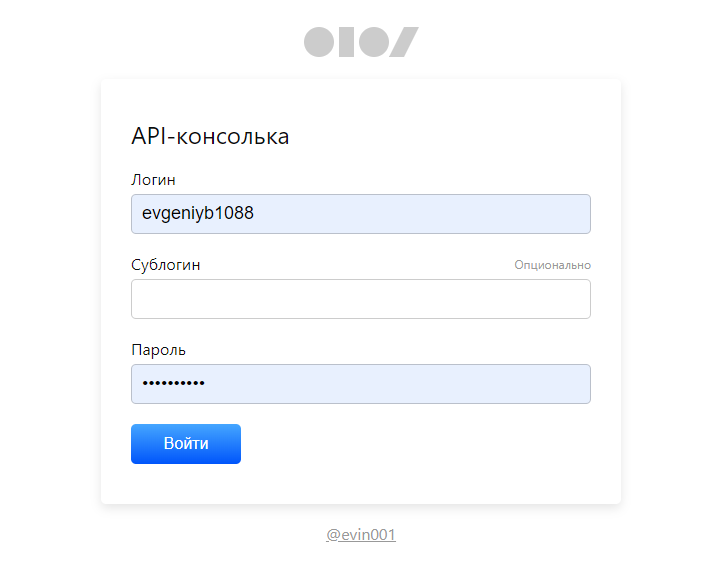
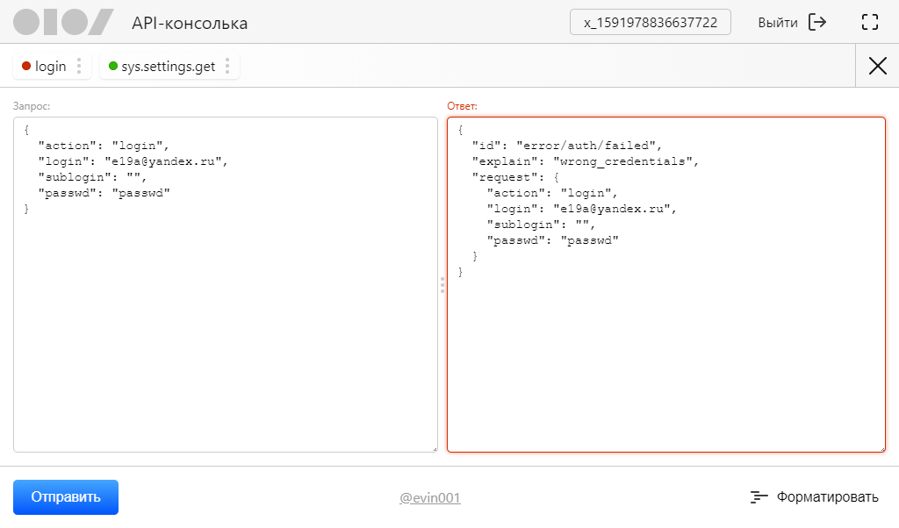

### Краткое описание

API-консоль состоит из формы авторизации и интерфейса консоли. Она используется, чтобы выполнять запросы к Sendsay API — пример такой консоли вы можете посмотреть в старом интерфейсе Sendsay.

### Валидация формы авторизации

Поля подсвечиваются, если пользователь введёт один из недопустимых символов. Дополнительных сообщений не выводится.

Выбран самый простой способ уведомления пользователя об ошибке.

### Форма авторизации

### Консоль

